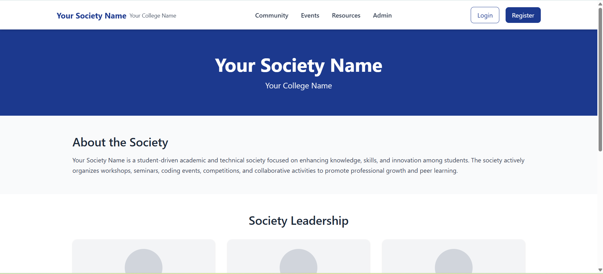
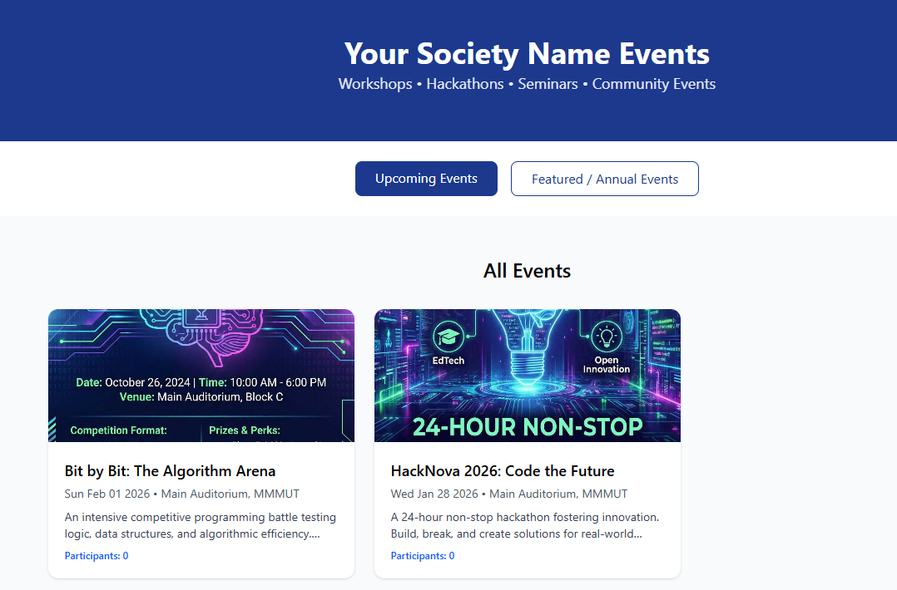
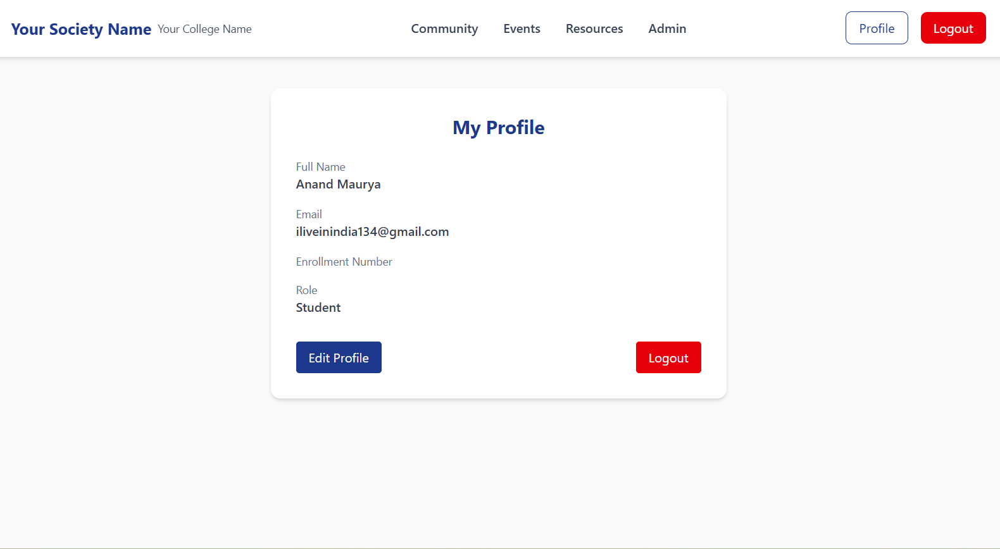
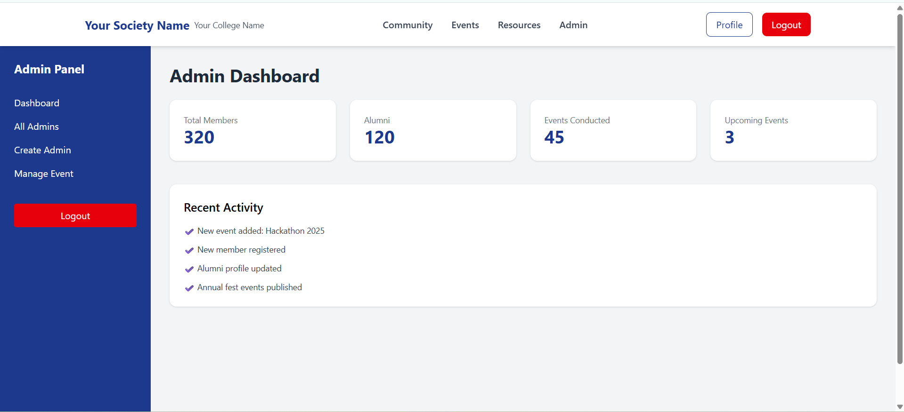
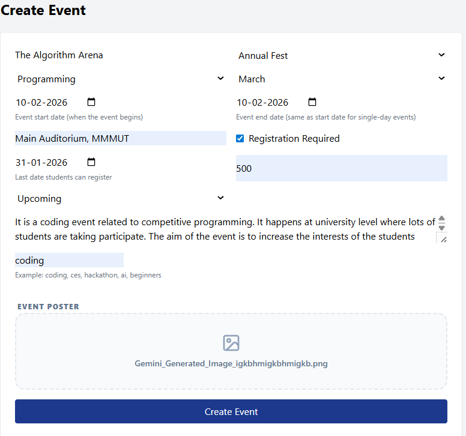
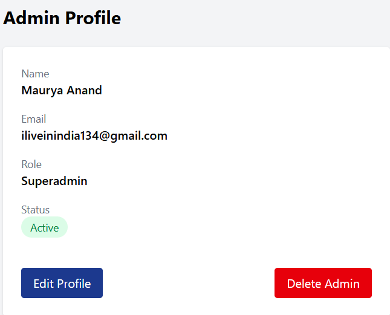

# 🎓 College Society Website Template

A **modern, reusable, and customizable website template** for **college societies, student clubs, technical groups, and academic communities**.

This project is designed so that **any college society can clone the repo, change a few config values, and deploy instantly** — without touching core code.

---

## 📸 Screen Previews

### 🌐 User Interface
| Home Page | Events Gallery | Student Profile |
| :---: | :---: | :---: |
|  |  |  |

### 🛡️ Admin Panel
| Admin Dashboard | Event Management | Admin Profile |
| :---: | :---: | :---: |
|  |  |  |

---

## ✨ Features

* ⚛️ **React-based frontend** (clean component structure)
* 🎨 **Modern UI** with Tailwind CSS
* 🔐 **Authentication system**
  * Student Login & Registration
  * Admin Login & Dashboard
* 📅 **Events management** (workshops, hackathons, seminars, fests)
* 👥 **Community & Alumni sections**
* 🧩 **Fully reusable template** (no hardcoded college/society names)
* ⚙️ **Centralized configuration** via one file

---

## 🧠 Key Idea (Why this template?)

Instead of hardcoding things like:

* Society name
* College name
* Emails

Everything is controlled from **one config file** 👇

```js
// frontend/src/config/site_config.jsx
export const SITE_CONFIG = {
  societyName: "Your Society Name",
  collegeName: "Your College Name",
  email: "contact@yoursociety.com",
};

---

## 📁 Project Structure (Simplified)

```
frontend/
├── src/
│   ├── components/
│   │   ├── Navbar.jsx
│   │   ├── Footer.jsx
│   │   └── admin/
│   ├── pages/
│   │   ├── Home_page.jsx
│   │   ├── OurCommunity.jsx
│   │   ├── Events.jsx
│   │   ├── Login.jsx
│   │   ├── Register.jsx
│   │   └── admin/
│   ├── config/
│   │   └── site_config.jsx   👈 MAIN CONFIG FILE
│   ├── hooks/
│   └── App.jsx
backend/
├── routes/
├── controllers/
├── models/
└── index.js
```

---

## 🚀 Getting Started

### 1️⃣ Clone the Repository

```bash
git clone https://github.com/your-username/college-society-website-template.git
cd college-society-website-template
```

---

### 2️⃣ Setup Frontend

```bash
cd frontend
npm install
npm run dev
```

Frontend will run on:

```
http://localhost:5173
```

---

### 3️⃣ Setup Backend

```bash
cd backend
npm install
npm run dev
```

Backend will run on:

```
http://localhost:5000
```

> ⚠️ Make sure MongoDB is running and environment variables are set.

---

## ⚙️ Customization Guide (Very Easy)

### ✏️ Change Society & College Name

Edit **one file only**:

```js
frontend/src/config/site_config.jsx
```

Example:

```js
export const SITE_CONFIG = {
  societyName: "Robotics Club",
  collegeName: "ABC Institute of Technology",
  email: "robotics@abc.edu",
};
```

---

### 🎨 Change Theme Colors

This project uses **Tailwind CSS**.

You can update colors in:

```js
tailwind.config.js
```

---

## 🔐 Authentication Flow

### 👤 Student

* Register
* Login
* View profile
* Participate in events

### 🛡️ Admin

* Admin Login
* Dashboard access
* Manage events
* View members

> Admin routes are protected using JWT tokens.

---

## 📅 Events Module

* Displays **upcoming & past events**
* Supports:

  * Event title
  * Date
  * Venue
  * Description
  * Poster
  * Participant count

Perfect for:

* Workshops
* Hackathons
* Seminars
* Annual fests

---

## 🧑‍🤝‍🧑 Community & Alumni

* Current members grid
* Alumni showcase
* Achievements & winners
* Core values section

All sections use **placeholders** so societies can easily fill real data.

---

## 🌐 Deployment

### Frontend

* Vercel
* Netlify

### Backend

* Render
* Railway
* VPS

Make sure to update API base URLs in frontend config.

---

## 📌 Who Should Use This?

* College technical societies
* Cultural clubs
* Robotics / Coding / AI clubs
* Student councils
* University departments

If you need a **quick professional website**, this template is for you.

---

## 🤝 Contributing

Contributions are welcome!

* Fork the repo
* Create a new branch
* Submit a pull request

---

## 📄 License

This project is licensed under the **MIT License**.

You are free to:

* Use
* Modify
* Distribute
* Deploy

---

## ⭐ Support

If you find this template useful:

* ⭐ Star the repository
* 🍴 Fork it
* 📢 Share it with your society

---

### 🚀 Built to save students time and help societies go online faster.

Happy building! 🎉
